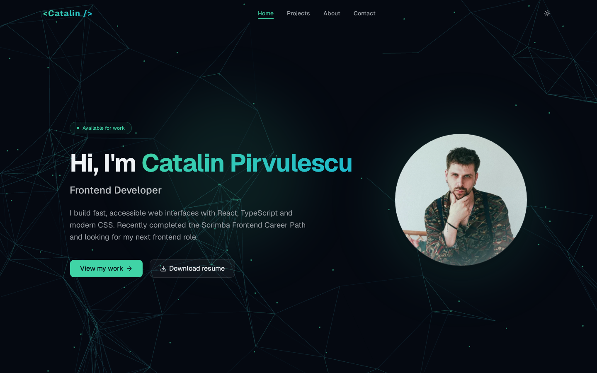

# Catalin Pirvulescu — Portfolio

Personal portfolio and digital resume of **Catalin Pirvulescu**, frontend developer.

**Live site: [catalinpirvulescu.netlify.app](https://catalinpirvulescu.netlify.app/)**



## Features

- **Light & dark theme** — token-driven design system (Tailwind CSS v4 + shadcn oklch tokens), dark by default, the toggle persists the choice, and a pre-paint script prevents any flash of the wrong theme
- **Accessible** — WCAG AA contrast in both themes, skip-to-content link, `aria-current` navigation, visible focus rings, semantic headings
- **Motion-safe** — reveal and hover animations respect `prefers-reduced-motion`
- **Fast** — three.js is code-split out of the initial bundle (~80 KB gzipped JS on first load), the particle background pauses on hidden tabs and slims down on mobile; images are optimized WebP with explicit dimensions (no layout shift)
- **SEO-ready** — full meta description, Open Graph / Twitter card tags and a generated social preview image

## Tech stack

React 19 · TypeScript · Vite · Tailwind CSS v4 · shadcn/ui (Base UI) · three.js · Geist

## Development

```bash
npm install
npm run dev       # start the dev server
npm run build     # type-check and build for production
npm run preview   # serve the production build
npm run lint      # run eslint
```

## Project screenshots

Project cards use images from `src/assets/projects/`. To replace the branded
placeholder cards with real screenshots of the live sites, run:

```bash
npm run capture
```

The script visits each live project with headless Chromium, saves optimized
960×540 WebP screenshots, regenerates the optimized profile photo and the
`public/og.jpg` social card. Re-run it whenever a project's UI changes.

## Deployment

The site deploys automatically to [Netlify](https://catalinpirvulescu.netlify.app/)
on every push to `master`.
